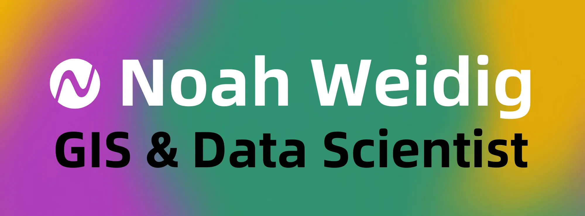

<!-- ⚡ Bolt Optimization: Converted PNG banner (498KB) to WebP (33KB) to reduce image payload by ~93% -->

 

<em>I translate the language of landscapes into maps, models, and meaning. 
Remote sensing · Spatial analysis · Time-series change detection. 
If Earth has a pattern, I want to find it.</em>

 

&nbsp;
&nbsp;
&nbsp;
&nbsp;
&nbsp;

 

---

### 👤 &nbsp;About

GIS analyst and data scientist at the intersection of **remote sensing**, **conservation science**, and **spatial storytelling**. I build tools, maps, and models that help people understand how landscapes change — and what those changes mean.

> Understanding patterns through time gives people the power to see beyond the moment and shape a more intentional world.

---

### 🔬 &nbsp;Active Research

<table role="presentation">
<tr>
<td width="50%" valign="top">

**🔥 Wildfire & Conservation**

- Role of Conservation Reserve Program lands in wildfire risk across the Great Plains
- Large wildfire regime analysis — Great Plains & Eastern Temperate Forests
- Wildfire damage assessment for structures

</td>
<td width="50%" valign="top">

**🗺️ Geospatial Tools & Data**

- Curating US Census TIGER Roads in Google Earth Engine
- Building geospatial data products for conservation decision-making
- Designing public-facing tools for science engagement

</td>
</tr>
</table>

---

### ⚙️ &nbsp;Stack

**Languages**

&nbsp;
&nbsp;
&nbsp;
&nbsp;
&nbsp;
&nbsp;
&nbsp;

**GIS & Remote Sensing**

&nbsp;
&nbsp;
&nbsp;
&nbsp;
&nbsp;
&nbsp;

**Data & Dev**

&nbsp;
&nbsp;
&nbsp;
&nbsp;
&nbsp;
&nbsp;
&nbsp;

---

### 🤝 &nbsp;Let's Work Together

I collaborate on projects that build **resilient landscapes and communities** through tools, research partnerships, and data pipelines.

 

&nbsp;&nbsp;

 

[<kbd>_Case studies · Maps · Publications &nbsp;→&nbsp; **noahweidig.com**_</kbd>](https://noahweidig.com "View my full portfolio at noahweidig.com")

 

